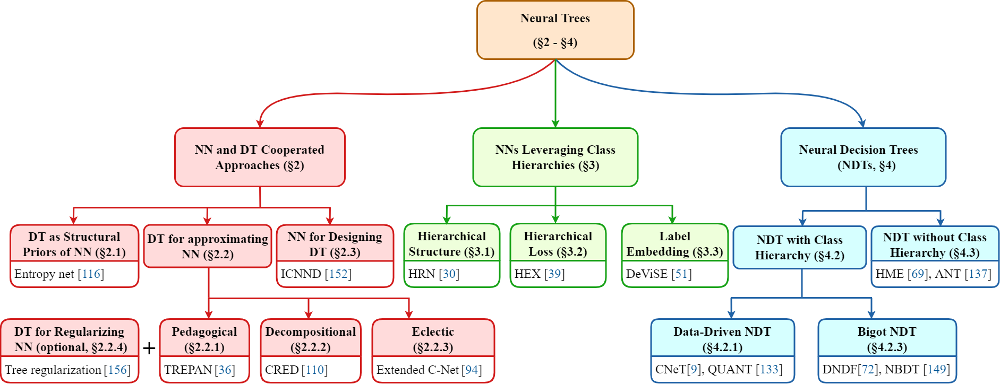
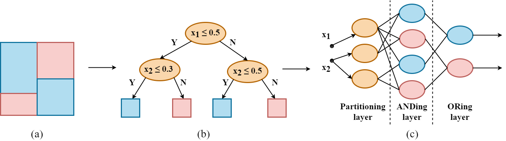
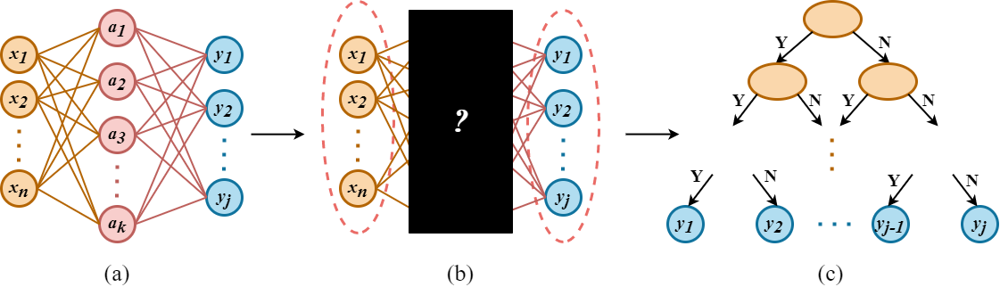
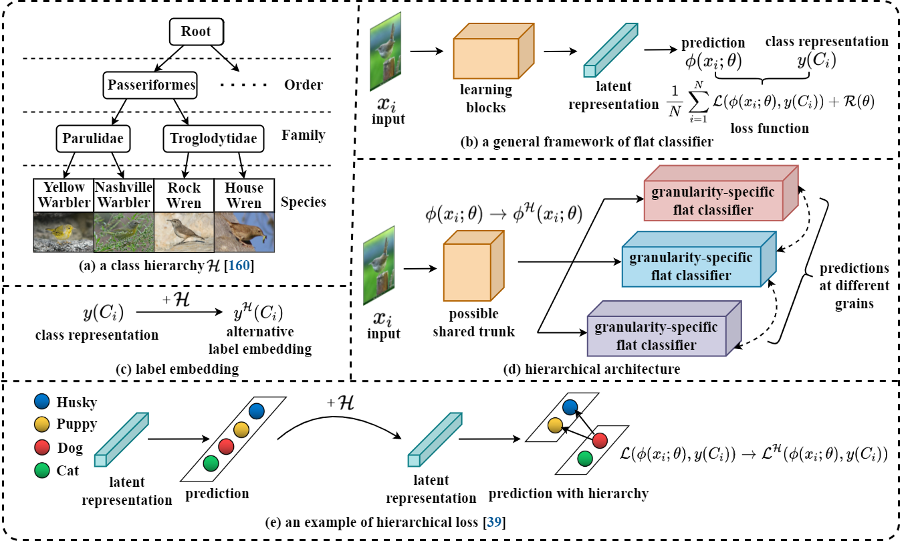
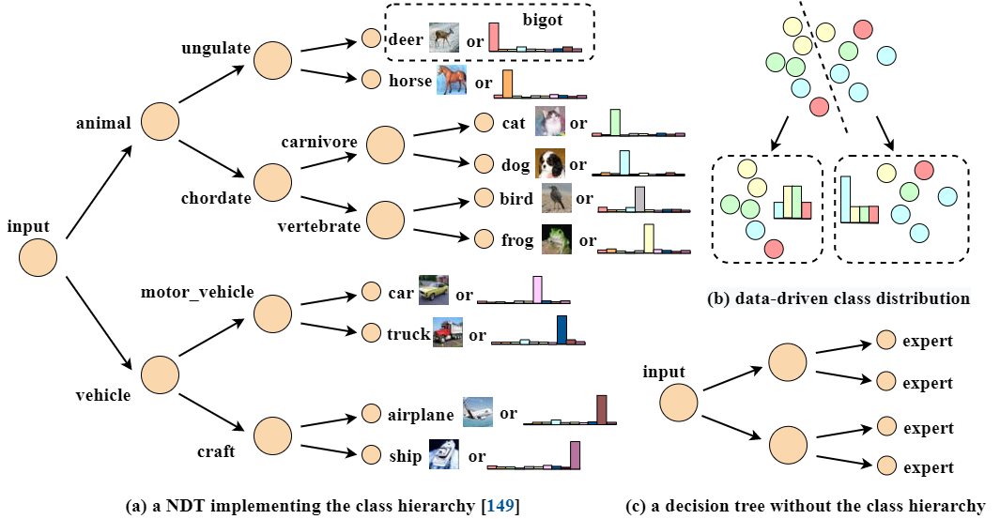

# Awesome Neural Tree Papers 
Selected papers and possible corresponding codes in our review paper **"A Survey of Neural Trees" [[arXiv Version]](https://arxiv.org/abs/2209.03415)**

*If you find there is a missed paper or a possible mistake in our survey, please feel free to email me or pull a request here. I am more than glad to receive your advice. Thanks!*

## Introduction
Neural trees (NTs) refer to a school of methods that combine neural networks (NNs) and decision trees (DTs), for which
we present a comprehensive review in this survey. Our keynote is to identify how these approaches enhance the model
interpretability and suggest possible solutions to the remaining challenges. Besides, we provide a discussion about
other considerations like conditional computation and promising directions towards this field, in hope to advance
the practice of NTs.

## *News!*
- New work of NTs and possible changes in this survey will be notified here.

### Citation 
If you find this survey useful for your research, please consider citing
```
@article{,
  title={A Survey of Neural Trees},
  author={},
  journal={},
  year={}
}
The missing information will be filled later.
```

Thanks!

## A Taxonomy of Current Methods
In this survey, we present a thorough taxonomy for NTs that expresses the gradual integration and co-evolution of NNs and DTs.
<p align='center'>
    </br>
    
</p>

### 1. Non-hybrid: NNs and DTs Cooperated Approaches.
These approaches are the very first to combine NNs and DTs. They employ DTs as auxiliaries for NNs as well as using
NNs as tools to improve the design of DTs. In these approaches, "neural" and "tree" are separated, *i.e.*, one of NN
and DT is assigned to accomplish a specific task, while the other performs as its assistant or interpreter. It can 
date back to the early 1990s when DTs were supposed to provide structural priors for NNs or extract rules from a 
trained NN. They are perceived implicit combinations of NNs and DTs, because NNs and DTs still operate on their 
own paradigms and no hybrid model is produced.

#### 1.1 DTs as Structural Priors of NNs.
Adopt DTs to approximate the target concept of NNs in terms of logical descriptions, *i.e.*, use DTs to design NNs 
with structural priors.

- ***Entropy net: the first practice***
  - **"Entropy nets: from decision trees to neural networks"**, Proceedings of the IEEE, 1990
    - I.K. Sethi
    - [[Paper]](https://ieeexplore.ieee.org/abstract/document/58346/)
  - **"Layered neural net design through decision trees"**, ISCAS, 1990
    - I.K. Sethi
    - [[Paper]](https://ieeexplore.ieee.org/abstract/document/112298)
  - **"Comparison between entropy net and decision tree classifiers"**, IJCNN, 1990
    - I.K. Sethi, Mike Otten
    - [[Paper]](https://ieeexplore.ieee.org/abstract/document/5726783)

An example for the original [entropy net](https://ieeexplore.ieee.org/abstract/document/58346/):

<p align='center'>
    </br>
    
</p>

- ***ID3-based algorithm that converts DTs into hidden layers:***
  - **"A machine learning method for generation of a neural network architecture: a continuous ID3 algorithm"**, IEEE Transactions on Neural Networks, 1992
    - K.J. Cios, N. Liu
    - [[Paper]](https://ieeexplore.ieee.org/abstract/document/125869)

- ***Soft thresholding of entropy net:***
  - **"Neural implementation of tree classifiers"**, IEEE Transactions on Systems, Man, and Cybernetics, 1995
    - I.K. Sethi
    - [[Paper]](https://ieeexplore.ieee.org/abstract/document/398685)

- ***Oblique trees version of entropy net:***
  - **"A mapping from linear tree classifiers to neural net classifiers"**, ICNN, 1994
    - Youngtae Park
    - [[Paper]](https://ieeexplore.ieee.org/abstract/document/374145)
  - **"Fast Training Algorithms for Multi-layer Neural Nets"**, IEEE Transactions on Neural Networks, 1991
    - Richard P. Brent
    - [[Paper]](https://citeseerx.ist.psu.edu/viewdoc/download?doi=10.1.1.122.4561&rep=rep1&type=pdf)

- ***A knowledge acquisition system that concerns about the knowledge form DTs and NNs prefer:***
  - **"Implementation and refinement of decision trees using neural networks for hybrid knowledge acquisition"**,  Artificial Intelligence in Engineering, 1995
    - Katsuhiko Tsujino, Shogo Nishida
    - [[Paper]](https://www.sciencedirect.com/science/article/abs/pii/0954181095000054)

- ***Create a disjunctive normal form formula for each class and reformulate the first layer of entropy net:***
  - **"Initializing neural networks using decision trees"**, published by Rutgers University, 1990
    - Arunava Banerjee
    - [[Paper]](https://scholarship.libraries.rutgers.edu/esploro/outputs/technicalDocumentation/Initializing-neural-networks-using-decision-trees/991031549998404646)
  - **"Initialization of neural networks by means of decision trees"**, Knowledge-Based Systems, 1995
    - Irena Ivanova, Miroslav Kubat
    - [[Paper]](https://www.sciencedirect.com/science/article/abs/pii/0950705196819174)
  - **"On mapping decision trees and neural networks"**, Knowledge-Based Systems, 1999
    - R.SetionoW, K.Leow
    - [[Paper]](https://www.sciencedirect.com/science/article/abs/pii/S095070519900009X)

#### 1.2 DTs for Approximating NNs.
Apply DTs to interpret trained NNs by approximating the network (mostly in terms of input-output mapping) and mimic
the decision boundaries implicitly learned by the hidden layers.

##### *1.2.1 Pedagogical Techniques.*
Treat NNs as black-box approaches, and extract the input-output rule directly form NNs regardless of its intermediate
layers.

A description of pedagogical techniques:

<p align='center'>
    </br>
    
</p>

- ***TREPAN: the first practice of DT-based interpretation***
  - **"Extracting Tree-Structured Representations of Trained Networks"**, NeurIPS, 1995
    - Mark Craven, Jude Shavlik
    - [[Paper]](https://proceedings.neurips.cc/paper/1995/hash/45f31d16b1058d586fc3be7207b58053-Abstract.html)
  - **"Using Sampling and Queries to Extract Rules from Trained Neural Networks"**, Machine Learning Proceedings, 1994
    - Mark Craven, Jude Shavlik
    - [[Paper]](https://www.sciencedirect.com/science/article/pii/B9781558603356500131)


- ***Remove insignificant input neurons from the trained network before inducing the DT***
  - **"Decision Tree Extraction using Trained Neural Network"**, SMARTGREENS, 2020
    - Nikola Vasilev *et al.*
    - [[Paper]](https://pdfs.semanticscholar.org/9528/ece5f2a9c71fac8ac258d6812ff5cc75da63.pdf)

- ***Turn the 𝑚-of-𝑛 type splits into standard splitting tests such as C4.5***
  - **"Decision Tree Extraction from Trained Neural Networks"**, AAAI, 2004
    - Darren Dancey *et al.* *(CART tree)*
    - [[Paper]](https://www.aaai.org/Papers/FLAIRS/2004/Flairs04-089.pdf)
  - **"Converting a trained neural network to a decision tree DecText - decision tree extractor"**, Dissertation, 2000
    - Olcay Boz *(propose discretization algorithms to handle continuous features)*
    - [[Paper]](https://www.proquest.com/openview/11cd66e5b5aab652403e370ca7bf1eef/1?pq-origsite=gscholar&cbl=18750&diss=y)
  - **"Extracting decision trees from trained neural networks"**, Pattern Recognition, 2020
    - Olcay Boz 
    - [[Paper]](https://dl.acm.org/doi/abs/10.1145/775047.775113)
  - **"NeC4.5: neural ensemble based C4.5"**, IEEE Transactions on Knowledge and Data Engineering, 2004
    - Zhi-Hua Zhou, Yuan Jiang *(use NN ensembles)*
    - [[Paper]](https://ieeexplore.ieee.org/abstract/document/1294896)
  - **"Extracting decision trees from trained neural networks"**, Pattern Recognition, 1999
    - R.Krishnan, *et al.* *(adapt genetic algorithms to generate artificial examples)*
    - [[Paper]](https://www.sciencedirect.com/science/article/abs/pii/S0031320398001812)

- ***generalize the TREPAN algorithm***
  - **"An investigation of TREPAN utilising a continuous oracle model"**, Data Analysis Techniques and Strategies, 2011 
    - William A Young *et al.* *(develop DTs derived from continuous-based models)*
    - [[Paper]](https://www.researchgate.net/profile/William-Young-10/publication/227441144_An_investigation_of_TREPAN_utilising_a_continuous_oracle_model/links/00b495258560f7e8d3000000/An-investigation-of-TREPAN-utilising-a-continuous-oracle-model.pdf?_sg%5B0%5D=started_experiment_milestone&origin=journalDetail)
  - **"Trepan-Plus: An Extension of a Decision Tree Extraction Algorithm Utilizing Artificial Neural Networks"**, Intelligent Engineering Systems Through Artificial Neural Networks, 2007
    - M Rangwala *et al.* *(extend TREPAN to multi-class regression problems)*
    - [[Paper]](https://d1wqtxts1xzle7.cloudfront.net/47121083/TREPAN-PLUS_AN_EXTENSION_OF_A_DECISION_T20160708-16395-1sj4ete-with-cover-page-v2.pdf?Expires=1662897159&Signature=C2Z0VL3cIkc56vlIci5ERXC7VADyi9tEqIlvJ3CqHzaLB9bfY9Tma8UVsZpu1BXI1l24paZ0iJArqUUzEqrTvum7s93dAUL-pKmmBKausyKiAw3qj2Bx18I5jzDOat2TCKA6wd2GbiexuK7gtlfNgeu03fBg0Rx2UWt~2KW6RNMeamZinhzp1FCrSzH4fFRqhTuc2~UgajTzsaUlJHbJef-s9u2wOiwqNiEUAfwN8zG0tIEt-fE0GEUdSC9AzBVXLpodLTadDzUZODX7lzUX~o00-ZHxKl7VOnbi0wQ8OZw087zKQjqQNOw1ik16zfKMamZW~YS6e38aUgud0sOrBg__&Key-Pair-Id=APKAJLOHF5GGSLRBV4ZA)
  - **"Extracting fuzzy symbolic representation from artificial neural networks"**, NAFIPS, 1999
    - Maciej Faifer *et al.* *(use fuzzy representation during the tree-induction process)*
    - [[Paper]](https://ieeexplore.ieee.org/abstract/document/781764)
  - **"DT+GNN: A Fully Explainable Graph Neural Network using Decision Trees"**, arXiv, 2022
    - Peter Müller *et al.* *(incorporate DTs into graph neural networks)*
    - [[Paper]](https://arxiv.org/abs/2205.13234)

- ***NNs perform significance analysis to select attributes***
  - **"ANN-DT: an algorithm for extraction of decision trees from artificial neural networks"**, IEEE Transactions on Neural Networks, 1999
    - Gregor PJ Schmitz *et al.*
    - [[Paper]](https://ieeexplore.ieee.org/abstract/document/809084)


##### *1.2.2 Decompositional Techniques.*
Decompositional techniques concern units in the hidden layers. They extract rules from the trained NN at the level of 
individual neurons, thus gaining insight into their inner structures.

- ***Extract axis-aligned trees***
  - **"Rule extraction from neural networks via decision tree induction"**, IJCNN, 2001
    - Makoto Sato, Hiroshi Tsukimoto *(CRED algorithm that deals with NNs with one hidden layer)*
    - [[Paper]](https://ieeexplore.ieee.org/abstract/document/938448)
  - **"DeepRED – Rule Extraction from Deep Neural Networks"**, International Conference on Discovery Science, 2016
    - Jan Ruben Zilke, Eneldo Loza Mencía, Frederik Janssen *(Extend CRED algorithm by deriving intermediate rules for every additional hidden layer)*
    - [[Paper]](https://link.springer.com/chapter/10.1007/978-3-319-46307-0_29)
  - **"Eclectic rule extraction from Neural Networks using aggregated Decision Trees"**, ICECE, 2012
    - MD. Ridwan Al Iqbal *(Simplify rules by logical simplification)*
    - [[Paper]](https://ieeexplore.ieee.org/abstract/document/6471502)

- ***Extract oblique and multivariate trees***
  - **"NeuroLinear: From neural networks to oblique decision rules"**, Neurocomputing, 1997 
    - Rudy Setiono, Huan Liu *(oblique trees)*
    - [[Paper]](https://www.sciencedirect.com/science/article/abs/pii/S0925231297000386)
  - **"Towards Interpretable ANNs: An Exact Transformation to Multi-Class Multivariate Decision Trees"**, 2020
    - Duy T Nguyen, Kathryn E Kasmarik, Hussein A Abbass *(multivariate trees)*
    - [[Paper]](http://arxiv-export-lb.library.cornell.edu/abs/2003.04675)

##### *1.2.3 Eclectic Techniques.*
Typically, eclectic techniques model the relationship between the last hidden layer and the outputs, then infer the
input-output relationship from the magnitudes of the weights in a NN. However, few of them are based on DTs. Therefore,
this survey comprises approaches that extract **partial knowledge** contained in the hidden layers and do not demand
their approximation target is the input-output relationship

- ***Extended C-Net algorithm***
  - **"Towards Interpretable ANNs: An Exact Transformation to Multi-Class Multivariate Decision Trees"**, arXiv, 2020
    - Duy T Nguyen, Kathryn E Kasmarik, Hussein A Abbass *(a typical eclectic technique)*
    - [[Paper]](http://arxiv-export-lb.library.cornell.edu/abs/2003.04675)

- ***Generalized eclectic techniques***
  - **"Global Model Interpretation Via Recursive Partitioning"**, HPCC/SmartCity/DSS, 2018
    - Chengliang Yang, Anand Rangarajan, Sanjay Ranka *(CART tree learned from the contribution matrix and applied to scene understanding tasks)*
    - [[Paper]](https://ieeexplore.ieee.org/abstract/document/8622994) [[Code]](https://github.com/west-gates/GIRP)
  - **"Interpreting CNNs via Decision Trees"**, CVPR, 2019
    - Quanshi Zhang *et al.* *(encodes all potential decision modes of the CNN in a coarse-to-fine manner)*
    - [[Paper]](https://openaccess.thecvf.com/content_CVPR_2019/html/Zhang_Interpreting_CNNs_via_Decision_Trees_CVPR_2019_paper.html)

##### *1.2.4 Optional: DTs for Regularizing NNs.*
These approaches train NNs that resemble compact DTs through crafted regularization terms, so that they can be well-approximated by small DTs.

- ***Tree regularization***
  - **"Beyond Sparsity: Tree Regularization of Deep Models for Interpretability"**, AAAI, 2018 
    - Mike Wu *et al.* *(a complexity penalty function that aims to optimize the deep model for interpretability and human-simulatability)*
    - [[Paper]](https://ojs.aaai.org/index.php/AAAI/article/view/11501) [[Code]](https://github.com/dtak/tree-regularization-public)
  - **"Regional Tree Regularization for Interpretability in Deep Neural Networks"**, AAAI, 2020
    - Mike Wu *et al. (extended work of tree regularization that encourage a deep model to be approximated by several separate DTs specific to pre-defined regions of the input space)*
    - [[Paper]](https://ojs.aaai.org/index.php/AAAI/article/view/6112)

- ***L1-orthogonal regularization***
  - **"Enhancing Decision Tree Based Interpretation of Deep Neural Networks through L1-Orthogonal Regularization"**, ICMLA, 2019
    - Nina Schaaf, Marco Huber, Johannes Maucher *(so that they do not need a surrogate network to estimate the tree loss)*
    - [[Paper]](https://ieeexplore.ieee.org/abstract/document/8999213)

#### 1.3 NNs for Designing DTs.
NNs specialized for designing more reasonable DTs and do not benefit from it, which is rare in practice.

- ***Induce DTs from more valid data filtered by the trained NNs***
  - **"An integrated approach of neural network and decision tree to classification"**, ICMLC, 2005
    - Xiao-Ye Wang, Xiu-Xia Liang, Ji-Zhou Sun
    - [[Paper]](https://ieeexplore.ieee.org/abstract/document/1527283)

### 2. Semi-hybrid: NNs Leveraging Class Hierarchies.
DT algorithms have two key ideas: "decision" and "tree". We view that "decision" is decision branches implemented by
routing functions, and "tree" is the model topology that identifies a class hierarchy. This survey tries to include
NNs that draw on a part of ideas from DTs, either the class hierarchy or the decision branches, but not both. These 
approaches are considered to be half and implicit integration of NNs and DTs. They borrow some inherent ideas from DTs
for NNs, instead of designing a NN that works like a DT. However, we only concern about the former in our taxonomy, 
*i.e.*, NNs leveraging class hierarchies. These approaches can not implement the class hierarchy in the network
structure due to the absence of decision branches, so they resort to incorporating the hierarchical relations into a NN
directly. There are three lines of research: hierarchical architecture, hierarchical loss function and label embedding
based methods, corresponding to different strategies of employing class hierarchies.

Overview of NNs exploiting class hierarchies: 

<p align='center'>
    </br>
    
</p>

Functions and notations in the figure are adopted from [Bertinetto *et al.*](https://openaccess.thecvf.com/content_CVPR_2020/html/Bertinetto_Making_Better_Mistakes_Leveraging_Class_Hierarchies_With_Deep_Networks_CVPR_2020_paper.html):

#### 2.1 Hierarchical Architecture.
These methods attempt to incorporate the class hierarchy into the architecture of the classifier, so that the networks
are designed to be branched and each branch is tasked to identify the concept abstraction at one specific level of the
class hierarchy.

- ***Hierarchical multi-label classification using local neural networks***
  - **"An integrated approach of neural network and decision tree to classification"**, ICMLC, 2014
    - Ricardo Cerri, Rodrigo C Barros, André CPLF De Carvalho
    - [[Paper]](https://www.sciencedirect.com/science/article/pii/S0022000013000718)
  - **"Reduction strategies for hierarchical multi-label classification in protein function prediction"**, BMC Bioinformatics, 2016
    - Ricardo Cerri *et al.*
    - [[Paper]](https://link.springer.com/article/10.1186/s12859-016-1232-1)
  - **"HD-CNN: Hierarchical Deep Convolutional Neural Networks for Large Scale Visual Recognition"**, ICCV, 2015
    - Zhicheng Yan *et al.*
    - [[Paper]](https://openaccess.thecvf.com/content_iccv_2015/html/Yan_HD-CNN_Hierarchical_Deep_ICCV_2015_paper.html) [[Code]](https://github.com/Changgang-Zheng/HD-CNN)
  - **"Your "Flamingo" is My "Bird": Fine-Grained, or Not"**, CVPR, 2021
    - Dongliang Chang *et al.* *(disentangle coarse and fine features)*
    - [[Paper]](https://openaccess.thecvf.com/content/CVPR2021/html/Chang_Your_Flamingo_is_My_Bird_Fine-Grained_or_Not_CVPR_2021_paper.html) [[Code]](https://github.com/PRIS-CV/Fine-Grained-or-Not)

- ***Branch the network after a shared trunk***
  - **"Learning to Make Better Mistakes: Semantics-aware Visual Food Recognition"**, ACM international conference on Multimedia, 2016 
    - Hui Wu *et al.* *(a single network backbone shared by multiple fully-connected layers)*
    - [[Paper]](https://dl.acm.org/doi/abs/10.1145/2964284.2967205)
  - **"Do Convolutional Neural Networks Learn Class Hierarchy?"**, TVCG, 2017
    - Alsallakh Bilal *et al.* *(deep CNN with branches at intermediate layers to fit the coarser-grained labels)*
    - [[Paper]](https://ieeexplore.ieee.org/abstract/document/8017618)
  - **"Fine-Grained Representation Learning and Recognition by Exploiting Hierarchical Semantic Embedding"**, ACM international conference on Multimedia, 2018
    - Tianshui Chen *et al.* *(introduce an attention mechanism to incorporate the coarse-grained results for learning finer-grained features)*
    - [[Paper]](https://dl.acm.org/doi/abs/10.1145/3240508.3240523)

- ***Interactions between different branches***
  - **"Label Hierarchy Transition: Modeling Class Hierarchies to Enhance Deep Classifiers"**, arXiv, 2021
    - Renzhen Wang, *et al* *(propose label hierarchy transition matrices whose column vectors represent the conditional label distributions of classes between two adjacent hierarchies)*
    - [[Paper]](https://arxiv.org/abs/2112.02353)
  - **"Label Relation Graphs Enhanced Hierarchical Residual Network for Hierarchical Multi-Granularity Classification"**, CVPR, 2022
    - Jingzhou Chen *et al.* *(propose the hierarchical residual network in which granularity-specific features from parent levels are added to features in children levels.)*
    - [[Paper]](https://openaccess.thecvf.com/content/CVPR2022/html/Chen_Label_Relation_Graphs_Enhanced_Hierarchical_Residual_Network_for_Hierarchical_Multi-Granularity_CVPR_2022_paper.html) [[Code]](https://github.com/MonsterZhZh/HRN)

#### 2.2 Hierarchical Loss Function.
Incorporate the class hierarchy into loss functions, which exploits the underlying hierarchical relationships and produce
predictions coherent with the pre-defined class hierarchy.

- ***Predict at each grain separately, *i.e.*, first take a model pre-trained on one level, then tune it using labels from other levels***
  - **"Coherent Hierarchical Multi-Label Classification Networks"**, NIPS, 2020
    - Eleonora Giunchiglia, Thomas Lukasiewicz
    - [[Paper]](https://proceedings.neurips.cc/paper/2020/hash/6dd4e10e3296fa63738371ec0d5df818-Abstract.html) [[Code]](https://github.com/EGiunchiglia/C-HMCNN)
  - **"Learning Hierarchical Visual Representations in Deep Neural Networks Using Hierarchical Linguistic Labels"**, arXiv, 2018
    - Joshua C Peterson *et al.*
    - [[Paper]](https://arxiv.org/abs/1805.07647)

- ***Utilize the hierarchical constraints directly***
  - **"Learning hierarchical similarity metrics"**, CVPR, 2012
    - Nakul Verma *et al.* *(probabilistic nearest-neighbor classification based framework)*
    - [[Paper]](https://ieeexplore.ieee.org/abstract/document/6247938)
  - **"Discriminative Transfer Learning with Tree-based Priors"**, NIPS, 2013
    - Nitish Srivastava, Russ R Salakhutdinov *(DNN with hierarchical priors over the parameters of the classification layer)*
    - [[Paper]](https://proceedings.neurips.cc/paper/2013/hash/9ac403da7947a183884c18a67d3aa8de-Abstract.html)
  - **"Large-Scale Object Classification Using Label Relation Graphs"**, ECCV, 2018
    - Jia Deng *et al.* *(encodes semantic relations into a directed acyclic graph and compute a loss defined on it)*
    - [[Paper]](https://link.springer.com/chapter/10.1007/978-3-319-10590-1_4) [[Code]](https://github.com/kylemin/HEX-graph)
  - **"Making Better Mistakes: Leveraging Class Hierarchies With Deep Networks"**, CVPR, 2020
    - Luca Bertinetto *et al.* *(incorporate class hierarchy into the cross-entropy loss)*
    - [[Paper]](https://openaccess.thecvf.com/content_CVPR_2020/html/Bertinetto_Making_Better_Mistakes_Leveraging_Class_Hierarchies_With_Deep_Networks_CVPR_2020_paper.html)

#### 2.3 Label Embedding.
These approaches aim to encode the class hierarchy into embeddings whose relative locations or possible interactions
represent the semantic relationships.

- ***DeViSE method that utilizes unannotated Wikipedia text***
  - **"DeViSE: A Deep Visual-Semantic Embedding Model"**, NIPS, 2013
    - Andrea Frome *et al.*
    - [[Paper]](https://proceedings.neurips.cc/paper/2013/hash/7cce53cf90577442771720a370c3c723-Abstract.html) [[Code]](https://github.com/jean4599/DeViSE)

- ***Embeddings whose pair-wise dot products correspond to semantic similarity between classes***
  - **"Hierarchy-Based Image Embeddings for Semantic Image Retrieval"**, WACV, 2019
    - Björn Barz, Joachim Denzler
    - [[Paper]](https://ieeexplore.ieee.org/abstract/document/8658633) [[Code]](https://github.com/cvjena/semantic-embeddings)

- **Employ the entailment cones to learn order-preserving embeddings**
  - **"Hierarchical Image Classification Using Entailment Cone Embeddings"**, CVPR, 2020
    - Ankit Dhall *et al.*
    - [[Paper]](https://openaccess.thecvf.com/content_CVPRW_2020/html/w50/Dhall_Hierarchical_Image_Classification_Using_Entailment_Cone_Embeddings_CVPRW_2020_paper.html) [[Code]](https://github.com/ankitdhall/learning_embeddings)

- ***Label embeddings in zero-shot classification***
  - **"Latent Embeddings for Zero-Shot Classification"**, CVPR, 2016
    - Yongqin Xian *et al.*
    - [[Paper]](https://openaccess.thecvf.com/content_cvpr_2016/html/Xian_Latent_Embeddings_for_CVPR_2016_paper.html)
  - **"Evaluation of Output Embeddings for Fine-Grained Image Classification"**, CVPR, 2015
    - Zeynep Akata *et al.*
    - [[Paper]](https://openaccess.thecvf.com/content_cvpr_2015/html/Akata_Evaluation_of_Output_2015_CVPR_paper.html)


### 3. Hybrid: Neural Decision Trees.
Neural Decision Trees (NDTs) are hybrid NN models that implement both the class hierarchy and the decision branches. 
Their core idea is to exploit NNs in the tree design by making the routing functions differentiable, thus allowing
gradient descent-based methods to optimize.

#### 3.1 Neural Decision Trees with Class Hierarchies.
If a NDT satisfies this property, it means each internal node is assigned a specific and intermediate
classification task. This "divide-and-conquer" strategy and stepwise inference process make the
model more interpretable, because each node in the tree is responsible and distinguishable from
other nodes.

##### *3.1.1 Data-Driven NDTs.*
Data-driven methods employ data-dependent heuristics to perform local optimization. The resultant tree will lead to 
a recursive partitioning of the input space 𝑋 through a cascade of tests and define the output of each leaf in terms
of examples falling within it.

A comparison between NDTs according to whether it implements a class hierarchy and whether it is data-driven:
<p align='center'>
    </br>
    
</p>

- ***Informativeness-related splitting functions with NN-based routers***
  - **"Neural trees-using neural nets in a tree classifier structure"**, ICASSP, 1991
    - J-E Stromberg, Jalel Zrida, Alf Isaksson *(train a small NN at each internal node, which singles out one unique class that gains
the most class purity)*
    - [[Paper]](https://www.computer.org/csdl/proceedings-article/icassp/1991/0003137/12OmNzdoMSH)
  - **"Evolutionary design of neural network tree-integration of decision tree, neural network and GA"**, CEC, 2001
    - Qiangfu Zhao *(use genetic algorithms to maximize the information gain ratio at each internal node)*
    - [[Paper]](https://ieeexplore.ieee.org/abstract/document/934395)
  - **"Hybrid decision tree"**, Knowledge-Based Systems, 2002
    - Zhi-Hua Zhou, Zhao-Qian Chen *(Divide the instance space into ordered attributes and unordered attributes)*
    - [[Paper]](https://www.sciencedirect.com/science/article/abs/pii/S0950705102000382)
  - **"Classification trees with neural network feature extraction"**, CVPR, 1992
    - Heng Guo, Saul B Gelfand *(find two clusters that minimizes a Gini impurity criterion, then find a good split through back-propagation)*
    - [[Paper]](https://www.computer.org/csdl/proceedings-article/cvpr/1992/00223275/12OmNzBOilt)

- ***Decrease the classification error at each node to be extended***
  - **"Growing and pruning neural tree networks"**, IEEE Transactions on Computers, 1993
    - A Sakar *et al.* *(Divide the instance space into ordered attributes and unordered attributes)*
    - [[Paper]](https://ieeexplore.ieee.org/abstract/document/210172)

- ***Grows during competitive learning***
  - **"Competitive neural trees for pattern classification"**,  IEEE Transactions on Neural Networks, 1998
    - Sven Behnke, Nicolaos B Karayiannis
    - [[Paper]](https://ieeexplore.ieee.org/abstract/document/728387)

- ***Map examples into the label embedding space and predicts using a NDT***
  - **"Label Embedding Trees for Large Multi-Class Tasks"**, NIPS, 2010
    - Samy Bengio, Jason Weston, David Grangier
    - [[Paper]](https://proceedings.neurips.cc/paper/2010/hash/06138bc5af6023646ede0e1f7c1eac75-Abstract.html)
  - **"Fast and Balanced: Efficient Label Tree Learning for Large Scale Object Recognition"**, NIPS, 2011
    - Jia Deng, Sanjeev Satheesh, Alexander Berg, Fei Li
    - [[Paper]](https://proceedings.neurips.cc/paper/2011/hash/5a4b25aaed25c2ee1b74de72dc03c14e-Abstract.html)

- ***Apply data-driven architectures to fuzzy NDTs***
  - **"Globally optimal fuzzy decision trees for classification and regression"**, IEEE Transactions on Pattern Analysis and Machine Intelligence, 1999
    - Alberto Suárez, James F Lutsko *(superimpose a fuzzy structure over the skeleton of a CART tree and introduce a global optimization algorithm)*
    - [[Paper]](https://ieeexplore.ieee.org/abstract/document/817409)
  - **"Budding Trees"**, ICPR, 2014
    - Ozan Irsoy, Olcay Taner Yildiz, Ethem Alpaydin *(a FDT model that can be dynamically adjusted)*
    - [[Paper]](https://ieeexplore.ieee.org/abstract/document/6977328) [[Code]](https://github.com/oir/budding-tree)
  - **"Convolutional Decision Trees for Feature Learning and Segmentation"**, GCPR, 2014
   - Dmitry Laptev, Joachim M Buhmann *(applies fuzzy NDTs to image segmentation by extracting the most informative and interpretable features)*
    - [[Paper]](https://link.springer.com/chapter/10.1007/978-3-319-11752-2_8)
  - **"Neural Decision Trees"**, arXiv, 2017
    - Randall Balestriero *(map similar inputs to the same hash value)*
    - [[Paper]](https://arxiv.org/abs/1702.07360)
  - **"Neuro-fuzzy decision trees"**, Neural Systems, 2006
    - Rajen B Bhatt, M Gopal *(employs fuzzy ID3 algorithm for DT-renovation)*
    - [[Paper]](https://www.worldscientific.com/doi/abs/10.1142/s0129065706000470)

- ***Incremental learning***
  - **"Hybrid decision tree"**, Knowledge-Based Systems, 2022
    - Zhi-Hua Zhou, Zhao-Qian Chen *(two example-incremental tasks, one hypothesis-driven constructive induction mechanism)*
    - [[Paper]](https://www.sciencedirect.com/science/article/abs/pii/S0950705102000382)
  - **"Soft decision trees"**, ICPR, 2012
    - Ozan Irsoy, Olcay Taner Yıldız, Ethem Alpaydın *(sigmoid-based FDT whose splits are made by checking if there is an improvement over the validation set)*
    - [[Paper]](https://ieeexplore.ieee.org/abstract/document/6460506)
  - **"A Neural Tree with Partial Incremental Learning Capability"**, ICMLC, 2007
    - Mu-Chun Su, Hsu-Hsun Lo *(choose a target class at each internal node and train a small NN to separate the positive patterns from negative ones)*
    - [[Paper]](https://ieeexplore.ieee.org/abstract/document/4370106)

##### *3.1.2 Bigot NDTs.*
A bigot NDT tends to have a pre-defined structure and determine leaves (pure classes or fixed class distributions) by
priors or algorithms such that induce the class hierarchy.

- ***Bigot NDTs with pure leaves***
  - **"Structure-driven induction of decision tree classifiers through neural learning"**, Pattern Recognition, 1997
    - Ishwar K Sethi *et al.* *(randomly initialized leaf classes)*
    - [[Paper]](https://www.sciencedirect.com/science/article/abs/pii/S0031320397000058)
  - **"NBDT: Neural-Backed Decision Trees"**, ICCV, 2020
    - Alvin Wan *et al.* *(assign a specific concept to each terminal and intermediate node by WordNet)*
    - [[Paper]](https://arxiv.org/abs/2004.00221) [[Code]](https://github.com/alvinwan/nbdt-pytorch-image-models)

- ***Bigot NDTs with determined leaf distributions***
  - **"Distilling a Neural Network Into a Soft Decision Tree"**, AI*IA, 2017
    - Nicholas Frosst, Geoffrey Hinton *(jointly optimize leaves and other parameters via back-propagation)*
    - [[Paper]](https://arxiv.org/abs/1711.09784) [[Code]](https://github.com/kimhc6028/soft-decision-tree)
  - **"Policy-gradient Methods for Decision Trees"**, ESANN, 2016
    - Aurélia Léon, Ludovic Denoyer *(use Monte Carlo approximation to expect the gradient of the objective function)*
    - [[Paper]](http://www.smart-labex.fr/publications/pdf/56eab488c05ef.pdf)
  - **"Deep Neural Decision Forests"**, ICCV, 2015
    - Peter Kontschieder *et al.* *(propose a derivative-free strategy to solely optimize the leaf parameters, as a convex optimization problem)*
    - [[Paper]](https://openaccess.thecvf.com/content_iccv_2015/html/Kontschieder_Deep_Neural_Decision_ICCV_2015_paper.html) [[Code]](https://github.com/jingxil/Neural-Decision-Forests)
  - **"Deep Regression Forests for Age Estimation"**, CVPR, 2018
    - Wei Shen *et al.* *(regression forests for age estimation)*
    - [[Paper]](https://openaccess.thecvf.com/content_cvpr_2018/html/Shen_Deep_Regression_Forests_CVPR_2018_paper.html) [[Code]](https://github.com/Sakura03/age_trans)
  - **"Neural Decision Forests for Semantic Image Labelling"**, CVPR, 2014
    - Samuel Rota Bulo, Peter Kontschieder *(decision forests for semantic image labelling)*
    - [[Paper]](https://www.cv-foundation.org/openaccess/content_cvpr_2014/html/Bulo_Neural_Decision_Forests_2014_CVPR_paper.html)
  - **"Neural Prototype Trees for Interpretable Fine-Grained Image Recognition"**, CVPR, 2021
    - WMeike Nauta, Ron van Bree, Christin Seifert *(prototype-based ante-hoc methods)*
    - [[Paper]](https://openaccess.thecvf.com/content/CVPR2021/html/Nauta_Neural_Prototype_Trees_for_Interpretable_Fine-Grained_Image_Recognition_CVPR_2021_paper.html?ref=https://githubhelp.com) [[Code]](https://github.com/M-Nauta/ProtoTree)
  - **"Learn decision trees with deep visual primitives"**, SSRN, 2022
    - Mengqi Xue, *et al*
    - [[Paper]](https://papers.ssrn.com/sol3/papers.cfm?abstract_id=4210199) 

- ***Bigot NDTs for knowledge distillation***
  - **"Tree-Like Decision Distillation"**, CVPR, 2021
    - Jie Song *et al.* *(layer-wise dissect the decision process of a DNN)*
    - [[Paper]](https://openaccess.thecvf.com/content/CVPR2021/html/Song_Tree-Like_Decision_Distillation_CVPR_2021_paper.html)
  - **"Tree-Like Branching Network for Multi-class Classification"**, LNNS, 2021
    - Mengqi Xue, Jie Song, Li Sun, Mingli Song *(mine the underlying category relationships from a trained teacher network and determines the appropriate layers on which specialized branches grow)*
    - [[Paper]](https://link.springer.com/chapter/10.1007/978-3-030-93247-3_18)
  - **"Distilling a Neural Network Into a Soft Decision Tree"**, AI*IA, 2017
    - Nicholas Frosst, Geoffrey Hinton *(use a trained NN to provide soft targets for training a fuzzy NDT)*
    - [[Paper]](https://arxiv.org/abs/1711.09784) [[Code]](https://github.com/kimhc6028/soft-decision-tree)
  - **"TNT: An Interpretable Tree-Network-Tree Learning Framework using Knowledge Distillation"**, Entropy, 2020
    - Jiawei Li *et al.* *(transfer knowledge between tree models and DNNs)*
    - [[Paper]](https://www.mdpi.com/1099-4300/22/11/1203)
  - **"KDExplainer: A Task-oriented Attention Model for Explaining Knowledge Distillation"**, arXiv, 2021
    - Mengqi Xue *et al.*
    - [[Paper]](https://arxiv.org/abs/2105.04181)

#### 3.2 Expert NDTs (NDTs without Class Hierarchies)
NDTs without class hierarchies restrain themselves little and perform arbitrary predictions at the leaves. Their 
leaf nodes are usually classifiers rather than determined classes or distributions.

- ***Hierarchical Mixtures of Experts (HME)***
  - **"Hierarchical Mixtures of Experts and the EM Algorithm"**, Neural computation, 1994 
    - Michael I Jordan, Robert A Jacobs *(the original HME, a tree-structured model for regression and classification.)*
    - [[Paper]](https://ieeexplore.ieee.org/abstract/document/6796382)
  - **"Classification using hierarchical mixtures of experts"**, NNSP, 1994
    - Steve R Waterhouse, Anthony J Robinson *(each leaf expert is non-linear and performs multi-way classification)*
    - [[Paper]](https://ieeexplore.ieee.org/abstract/document/366050)
  - **"Bayesian Hierarchical Mixtures of Experts"**, arXiv, 2012
    - Christopher M Bishop, Naonori Ueda, Steve Waterhouse *(bayesian treatments of the HME model to prevent the severe overfitting caused by maximum likelihood)*
    - [[Paper]](https://arxiv.org/abs/1212.2447)
  

- ***Generalized HMEs in advanced frameworks***
  - **"Attention Convolutional Binary Neural Tree for Fine-Grained Visual Categorization"**, CVPR, 2020
    - Ruyi Ji *et al.* *(incorporate convolutional operations along edges and use attention transformer modules to capture discriminative features)*
    - [[Paper]](https://openaccess.thecvf.com/content_CVPR_2020/html/Ji_Attention_Convolutional_Binary_Neural_Tree_for_Fine-Grained_Visual_Categorization_CVPR_2020_paper.html) [[Code]](https://isrc.iscas.ac.cn/gitlab/research/acnet)
  - **"NDT: Neual Decision Tree Towards Fully Functioned Neural Graph"**, arXiv, 2017
    - Han Xiao *(reformulate the non-differentiable information gain in the form of Dirac symbol and approximate it as a continuous function)*
    - [[Paper]](https://arxiv.org/abs/1712.05934)
  - **"Decision Forests, Convolutional Networks and the Models in-Between"**, arXiv, 2016
    - Yani Ioannou *et al.* *(hybrid model between decision forests and convolutional networks)*
    - [[Paper]](https://arxiv.org/abs/1603.01250)
  - **"Deep Neural Decision Trees"**, arXiv, 2018
    - Yongxin Yang, Irene Garcia Morillo, Timothy M Hospedales *(bin each feature of the input instance and determine the leaf node it will arrive)*
    - [[Paper]](https://arxiv.org/abs/1806.06988) [[Code]](https://github.com/wOOL/DNDT)
  - **"ViT-NeT: Interpretable Vision Transformers with Neural Tree Decoder"**, ICML, 2022
    - Sangwon Kim, Jaeyeal Nam, Byoung Chul Ko *(transformer version of ProtoTree with expert leaves)*
    - [[Paper]](https://proceedings.mlr.press/v162/kim22g.html) [[Code]](https://github.com/jumpsnack/ViT-NeT)

- ***Expert NDTs with architecture search phase***
  - **"Adaptive Neural Trees"**, ICML, 2019
    - Ryutaro Tanno *et al.* *(greedily choosing the best option between going deeper and splitting the input space)*
    - [[Paper]](http://proceedings.mlr.press/v97/tanno19a.html?utm_campaign=piqcy&utm_medium=email&utm_source=Revue%20newsletter) [[Code]](https://github.com/rtanno21609/AdaptiveNeuralTrees)
  - **"Self-Born Wiring for Neural Trees"**, ICCV, 2021
    - Ying Chen *et al.* *(NDTs that are self-born from a large search space)*
    - [[Paper]](https://openaccess.thecvf.com/content/ICCV2021/html/Chen_Self-Born_Wiring_for_Neural_Trees_ICCV_2021_paper.html) [[Code]](https://github.com/HollyLee2000/SeBoW-paddle)

